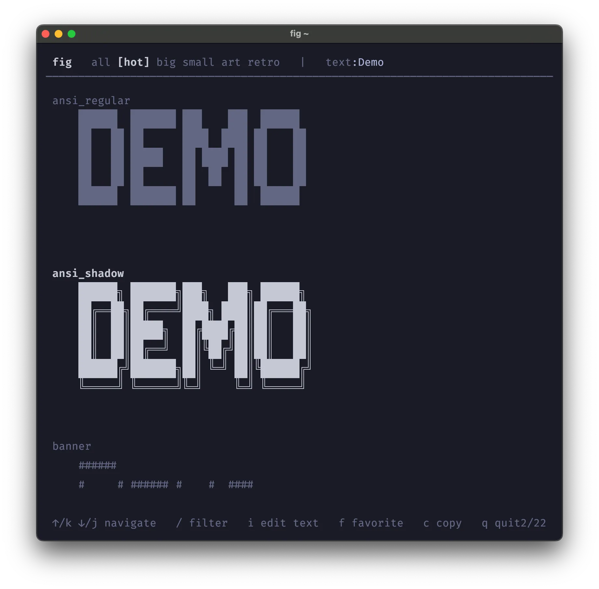

# Fig

`fig` is a modern interactive tool for rendering text as ASCII using [FIGlet](https://www.figlet.org/) fonts. It provides a traditional CLI for quick rendering and an interactive TUI for browsing and previewing fonts.



### ✨ Features

- **Interactive TUI** — displays live previews
- **Copy to clipboard** — copy selected preview
- **Add to favorites** — favorite fonts show up first
- **Supports 300 FIGlet Fonts**

## Install

**From source**

```go
go run cmd/main.go
```


## Usage

### Command Line Interface

```shell
fig Hello
fig -f slant "Hello"
echo "Hello" | fig
echo "Hello" | fig -f slant
```

#### Flags

```shell
  -c, --center        Center text in terminal
  -f, --font string   Specify a font, default is standard (default "standard")
  -h, --help          help for fig
  -l, --list-fonts    List all available fonts
  -r, --right         Right align text in terminal
  -v, --version       version for fig
```


### Terminal UI

```shell
fig
```

#### Keymaps

Press ? to show a list of available keymaps:

| Key       | Description                    |
| --------- | ------------------------------ |
| Enter     | Read comments                  |
| /         | Filter fonts                   |
| Tab       | Change to next category        |
| Shift+Tab | Change to previous category    |
| i         | Modify font preview text       |
| c         | Copy selection to clipboard    |
| f         | Add to / remove from favorites |
| q         | Quit                           |
| g         | Jump to the start              |
| G         | Jump to the end                |

## Under the hood

`fig` uses:

- [Bubbletea](https://github.com/charmbracelet/bubbletea) for the TUI
- [Lipgloss](https://github.com/charmbracelet/lipgloss) for styling
- [Bubbles](https://github.com/charmbracelet/bubbles) for UI components
- [Cobra](https://github.com/spf13/cobra) for the CLI
- [Figlet Fonts](https://github.com/xero/figlet-fonts) borrowed from [xero/fonts](https://github.com/xero/figlet-fonts)

